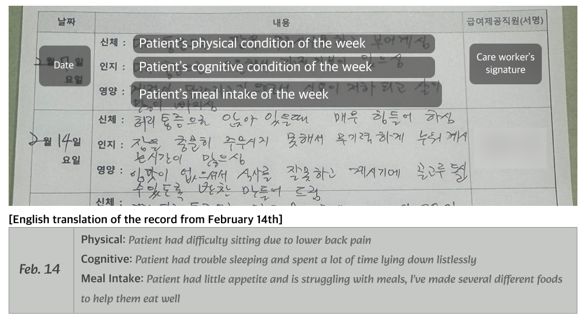

_Home-based care visit captured during our observations_

**Home-based care (HBC)** can look like a simple shift in location. Care moves from a clinic to a living room. But once care happens inside a home, decisions and relationships start to change shape.

This paper looks at patient agency in HBC and asks two questions: How does agency actually show up in everyday HBC? Why is it so hard for that agency to be reflected in shared care plans?

We conducted 23 **interviews** with HBC patients, healthcare professionals, and care workers, and we carried out 60 hours of **ethnographic observations** in the field. We also examined the documents that hold the network together, including care worker reports and electronic medical records.

_A weekly care report captured during our observations. The top panel depicts the original handwritten record in Korean, with overlays that label the core schema. The bottom panel presents our English translation of the entry._

A key idea in the paper is that **patient agency is a relational capacity,** not simply a fixed individual attribute. It grows or shrinks through interactions with care providers and through the constraints and affordances of the home. However, even when patients expressed clear intentions, those intentions often failed to travel through the care network. The paper describes this as **a representation gap.** Agency is present in practice, but it becomes hard to represent within the information systems and hierarchies that organize care.

Based on these insights, this paper offers design considerations that aim to bridge the representation gap and make patient agency more present in shared planning.

In conclusion, this work reframes patient agency in HBC as something built through relationships, recognition, and the lived material context of the home. It also shows that information practices are not neutral. They decide what counts and what can be shared.

This paper was published at **[CHI 2026](https://chi2026.acm.org/)** in Barcelona.
